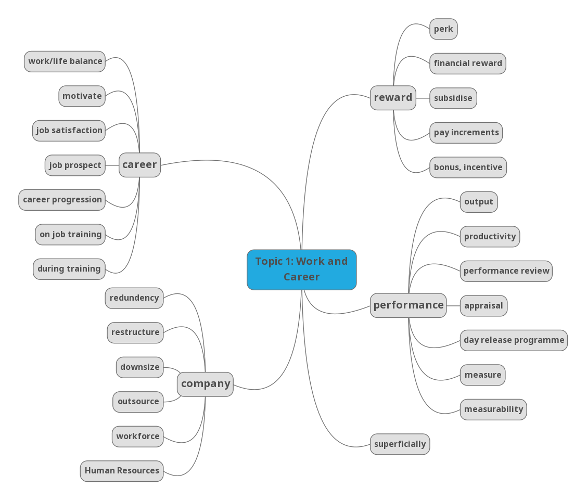

# Vocabulary

## Documents
- [Topic 1: Work and careers](<docs/Ielts-band-9-vocab Topic 1 - Work & Careers.pdf>)
- [Topic 2: Education and Schooling](<docs/Ielts-band-9-vocab Topic 2- Education and schooling.pdf>)
- [Topic 3: Children and Families](<docs/Ielts-band-9-vocab-Topic 3- Children and families.pdf>)
- [Topic 4: Nature, the environment and energy](<docs/Ielts-band-9-vocab-Topic 4- Nature, the environment and energy.pdf>)
- [Topic 5: Culture, art and traditions](<docs/Ielts-band-9-vocab-Topic 5- Culture, art and traditions.pdf>)

## Mindmaps
- 